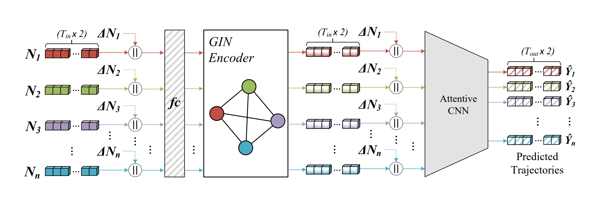

# Pishgu: Universal Path Prediction Network Architecture for Real-time Cyber-physical Edge Systems

[](https://arxiv.org/abs/2210.08057)
[](https://paperswithcode.com/sota/trajectory-prediction-on-actev?p=pishgu-universal-path-prediction-architecture)
[](https://paperswithcode.com/sota/trajectory-prediction-on-ngsim?p=pishgu-universal-path-prediction-architecture)

This repo contains the official Pytorch implementation of paper ["Pishgu: : Universal Path Prediction Network Architecture for Real-time Cyber-physical Edge Systems"](https://arxiv.org/pdf/2210.08057.pdf) accepted to be published and presented at [IEEE/ACM ICCPS 2023](https://iccps.acm.org/2023/). We present a universal architecture for trajectory prediction for pedestrians and vehicles from various points of view specifically designed for CPS applications. Pishgu is lightweight and captures the interdependencies between subjects using Graph Isomorphism Network (GIN). Morevover, by utilizing attentive convolutional layers, Pishgu is able to focus on more informative features and define a novel approach for trajectory prediction. 


## Domains and Datasets
- Vehicle Bird's-eye View: NGSIM Dataset
- Pedestrian Bird's-eye View: UCY and ETH Datasets
- Pedestrian High-angle View: VIRAT/ActEV Dataset

You can download the preprocessed data from this [link](https://drive.google.com/file/d/16xKlIgvZQrpi0Wm6sPpKyhGjQRPIwFW0/view?usp=sharing). 

## Installation 
```bash
git clone https://github.com/TeCSAR-UNCC/Pishgu.git
cd Pishgu
pip install -r requirments.txt
```

## Training and Testing
Each domain has a corresponding Config file in configs folder. For training and saving the model in the Training section just set the "save_model" and "train" fields to True and use the following command:
```bash
python3 main.py --config {path_to_the_config_file}
```

For testing, just give the path to desired model in the config file and set "save_model" and "train" fields to False and use the same command:
```bash
python3 main.py --config {path_to_the_config_file}
```

We also provide the trained weights in all domains in the the "model" folder. 

## Citation
If you found Pishgu helpful and used it in your research, please use the folllowing BibTeX entry:
```
@article{noghre2022pishgu,
  title={Pishgu: Universal Path Prediction Architecture through Graph Isomorphism and Attentive Convolution},
  author={Noghre, Ghazal Alinezhad and Katariya, Vinit and Pazho, Armin Danesh and Neff, Christopher and Tabkhi, Hamed},
  journal={arXiv preprint arXiv:2210.08057},
  year={2022}
}
```
## Refrences

This repo is based on these awesome works:
- [CARPe_Posterum](https://github.com/TeCSAR-UNCC/CARPe_Posterum)
- [Social GAN](https://github.com/agrimgupta92/sgan)

